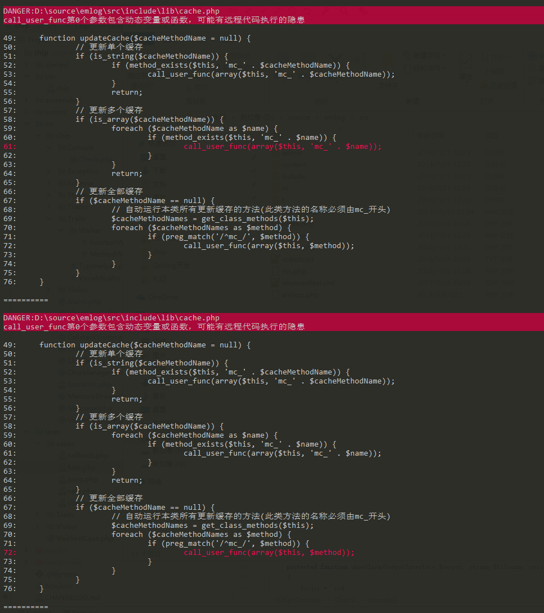

# Chip - 发现所有PHP动态特性安全隐患

## 工具介绍



用一些简单的问题来介绍Chip工具。

### 这个工具是做什么的？

PHP源代码静态分析，发掘所有可能由于动态特性导致的安全隐患。

### 什么是“动态特性”？

一段代码，其使用变量作为参数，且改变变量的值将可能导致这段代码发生功能上的变化，我将这种现象成为“PHP的动态特性”。

例如：

```php
<?php
eval('echo ' . $_POST['name']);
```

例如：

```php
<?php
array_map($function_name, $_POST);
```

例如：

```php
<?php
$f($arg);
```

### Chip是不是一个webshell检测工具？

不是。Chip只对扫描的代码提出安全建议，并不会判断这段代码是否是webshell。

### Chip是不是一个自动化代码审计工具？

不是。Chip只对扫描的代码提出安全建议，不会分析上下文是否有用户输入，安全隐患点是否可控等。

### Chip适合在哪些场景下使用？

- 在开发中，在持续集成阶段对开发者提交的代码进行安全性检查，并给出修改意见
- 在代码审计中，发现可能存在的代码活命令执行漏洞
- Wargame比赛中对流量、新的Web文件进行扫描

### Chip不适合扫描哪些代码

- Web框架的库文件（不要扫描`/vendor/`中的文件），原因是有的库使用了很多黑魔法，可能涉及到大量动态特性
- 业务中的确使用了很多动态特性的代码

## 安装与使用

### 命令行下使用

直接下载[PHAR](https://github.com/phith0n/chip/releases)包，使用命令行调用：

```
php chip.phar check tests/cases/
```

生成html报告：

```
php chip.phar check tests/cases/ -r html -o report.html
```

### 使用API调用

使用composer安装：

```
composer require phith0n/chip "dev-master"
```

使用：

```php
<?php
require 'vendor/autoload.php';

use Chip\Exception\FormatException;
use Chip\ChipFactory;

try {
    $chipManager = (new ChipFactory)->create();
    $alarm = $chipManager->detect('<?php usort($a, $b);');

    print_r($alarm);
} catch (FormatException $e) {
    echo $e->getMessage();
}
```

## 应该参考的项目

- https://github.com/nbs-system/php-malware-finder
- https://github.com/OneSourceCat/phpvulhunter
